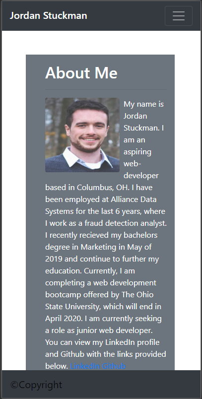
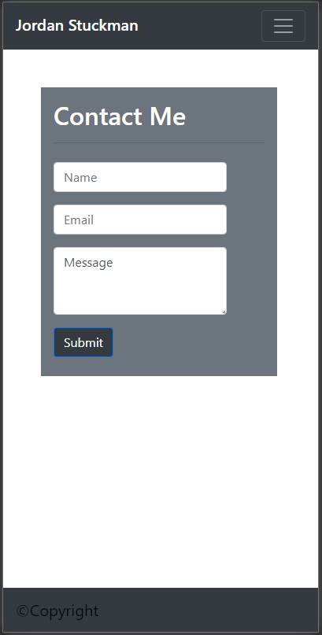

# My Portfolio Website

## Project Name: Responsive Portfolio

## Description:
This project is a personal portfolio website to show potential employers. The website is divided into 3 pages: About Me(index.html), Contact Me(contact.html), Portfolio(portfolio.html). Bootstrap used to format and style the site.

* About Me
  * displays a photo of me and a short bio
  
* Contact Me
  * displays a contact form
  * users can enter their contact information and a short message (not functional yet)

* Portfolio
  * displays a photo gallery of web development projects I have completed 

    
## Visual:

[Gitpages Link](https://jordanks93.github.io/Responsive-Portfolio/)

## Author: 
Jordan Stuckman
